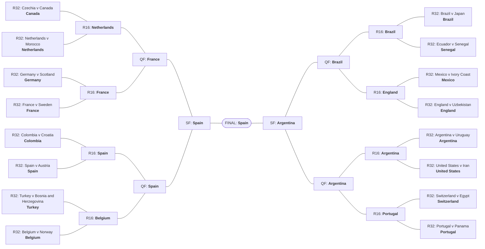

# ⚽ World Cup 2026 Prediction

A probabilistic forecasting system for the 2026 FIFA World Cup: independent Poisson
regressions on Elo-based covariates, feeding a 100,000-run
Monte Carlo simulation of the full 48-team tournament. Backtested against the 2018 and
2022 World Cups, where it beats the no-skill baseline on Brier and RPS in both.

For derived projections (group of death, dark horses, marquee matchups, title paths),
see [showcase.md](showcase.md).

## 2026 Forecast (pre-tournament snapshot)

100,000 Monte Carlo simulations, cutoff **2026-06-11**, before kickoff. Probability (%)
of winning the title and of reaching at least each stage.

My model predicts the 2026 World Champion is **🇪🇸 Spain**, with a probability of 17.1%.

| # | Team | **Champion** | Final | SF | QF | R16 | R32 |
|---|---|---|---|---|---|---|---|
| 1 | 🇪🇸 Spain | **17.10** | 28.6 | 43.1 | 53.9 | 74.6 | 99.7 |
| 2 | 🇦🇷 Argentina | **16.33** | 27.2 | 39.7 | 57.9 | 68.8 | 98.8 |
| 3 | 🇫🇷 France | **14.25** | 25.6 | 44.3 | 60.7 | 82.0 | 98.3 |
| 4 | 🇵🇹 Portugal | **11.33** | 19.1 | 30.4 | 48.6 | 72.4 | 96.1 |
| 5 | 🇧🇷 Brazil | **6.99** | 13.0 | 25.0 | 41.5 | 61.7 | 95.0 |
| 6 | 🇨🇴 Colombia | **6.18** | 12.5 | 22.5 | 39.6 | 66.8 | 95.0 |
| 7 | 🏴󠁧󠁢󠁥󠁮󠁧󠁿 England | **5.84** | 13.2 | 28.5 | 47.3 | 69.6 | 97.2 |
| 8 | 🇳🇱 Netherlands | **4.01** | 8.8 | 19.4 | 38.2 | 53.6 | 92.8 |
| 9 | 🇩🇪 Germany | **2.88** | 7.2 | 17.1 | 30.1 | 65.0 | 97.2 |
| 10 | 🇺🇾 Uruguay | **2.72** | 6.3 | 12.7 | 23.8 | 39.0 | 92.4 |
| 11 | 🇲🇦 Morocco | **1.89** | 4.3 | 10.7 | 23.4 | 42.8 | 86.1 |
| 12 | 🇧🇪 Belgium | **1.88** | 5.2 | 12.3 | 35.4 | 65.3 | 95.2 |
| 13 | 🇭🇷 Croatia | **1.43** | 4.0 | 10.5 | 21.5 | 45.1 | 90.7 |
| 14 | 🇸🇳 Senegal | **1.31** | 3.6 | 9.6 | 20.7 | 42.5 | 79.8 |
| 15 | 🇯🇵 Japan | **1.02** | 2.9 | 7.8 | 18.6 | 33.4 | 80.2 |
| 16 | 🇨🇭 Switzerland | **0.85** | 2.7 | 7.7 | 23.9 | 61.7 | 95.8 |
| 17 | 🇩🇿 Algeria | **0.60** | 1.7 | 4.4 | 10.9 | 23.7 | 70.8 |
| 18 | 🇪🇨 Ecuador | **0.53** | 1.9 | 6.5 | 16.5 | 46.1 | 91.0 |
| 19 | 🇦🇹 Austria | **0.44** | 1.4 | 3.9 | 10.3 | 23.3 | 73.8 |
| 20 | 🇹🇷 Turkey | **0.39** | 1.5 | 4.7 | 17.0 | 43.6 | 76.0 |
| 21 | 🇨🇮 Ivory Coast | **0.31** | 1.0 | 3.4 | 9.6 | 28.4 | 74.9 |
| 22 | 🇺🇸 United States | **0.25** | 1.0 | 3.4 | 13.1 | 37.8 | 70.6 |
| 23 | 🇨🇦 Canada | **0.23** | 0.9 | 3.6 | 15.8 | 49.7 | 93.5 |
| 24 | 🇵🇾 Paraguay | **0.23** | 0.9 | 3.0 | 11.9 | 35.3 | 68.4 |
| 25 | 🇲🇽 Mexico | **0.17** | 1.0 | 5.3 | 20.4 | 58.3 | 92.9 |
| 26 | 🏴󠁧󠁢󠁳󠁣󠁴󠁿 Scotland | **0.14** | 0.6 | 2.7 | 9.4 | 24.9 | 72.4 |
| 27 | 🇨🇿 Czechia | **0.13** | 0.7 | 2.9 | 11.6 | 36.1 | 75.4 |
| 28 | 🇮🇷 Iran | **0.12** | 0.6 | 2.5 | 11.9 | 39.6 | 83.8 |
| 29 | 🇦🇺 Australia | **0.10** | 0.5 | 2.0 | 8.6 | 28.6 | 60.8 |
| 30 | 🇰🇷 South Korea | **0.10** | 0.5 | 2.3 | 10.2 | 32.1 | 70.5 |
| 31 | 🇸🇪 Sweden | **<0.1** | 0.4 | 1.8 | 6.4 | 16.2 | 62.1 |
| 32 | 🇪🇬 Egypt | **<0.1** | 0.3 | 1.1 | 5.0 | 21.5 | 62.3 |
| 33 | 🇹🇳 Tunisia | **<0.1** | 0.1 | 0.6 | 2.4 | 7.8 | 36.5 |
| 34 | 🇳🇴 Norway | **<0.1** | 0.3 | 2.2 | 9.2 | 27.6 | 70.4 |
| 35 | 🇵🇦 Panama | **<0.1** | 0.1 | 0.5 | 2.1 | 9.0 | 48.8 |
| 36 | 🇺🇿 Uzbekistan | **<0.1** | 0.1 | 0.4 | 2.1 | 8.9 | 40.1 |
| 37 | 🇿🇦 South Africa | **<0.1** | 0.1 | 0.4 | 2.1 | 8.9 | 32.4 |
| 38 | 🇸🇦 Saudi Arabia | **<0.1** | <0.1 | 0.2 | 1.0 | 4.7 | 28.3 |
| 39 | 🇧🇦 Bosnia and Herzegovina | **<0.1** | <0.1 | 0.2 | 2.1 | 11.9 | 49.3 |
| 40 | 🇨🇩 DR Congo | **<0.1** | <0.1 | 0.2 | 1.2 | 5.6 | 28.1 |
| 41 | 🇮🇶 Iraq | **<0.1** | <0.1 | 0.1 | 0.6 | 2.9 | 15.8 |
| 42 | 🇬🇭 Ghana | **<0.1** | <0.1 | 0.1 | 0.8 | 4.2 | 29.7 |
| 43 | 🇨🇻 Cape Verde | **0** | <0.1 | 0.1 | 0.7 | 3.9 | 26.8 |
| 44 | 🇳🇿 New Zealand | **0** | <0.1 | <0.1 | 0.4 | 4.4 | 26.6 |
| 45 | 🇯🇴 Jordan | **0** | <0.1 | 0.1 | 0.6 | 3.3 | 22.1 |
| 46 | 🇭🇹 Haiti | **0** | 0 | <0.1 | 0.4 | 2.6 | 19.4 |
| 47 | 🇶🇦 Qatar | **0** | 0 | <0.1 | 0.5 | 3.8 | 25.3 |
| 48 | 🇨🇼 Curaçao | **0** | 0 | <0.1 | 0.1 | 1.0 | 10.7 |

### Projected bracket

A single self-consistent **chalk** projection: modal R32 occupants chained forward, each
tie re-simulated 100,000× with the match engine and the modal winner advancing. The honest
per-stage marginals are in [showcase.md](showcase.md).

**Projected champion: Spain**



<details><summary>Full projected bracket table</summary>

| match | round | team_a | team_b | projected_winner | p_winner |
| --- | --- | --- | --- | --- | --- |
| 73 | R32 | Czechia | Canada | Canada | 0.5224 |
| 74 | R32 | Germany | Scotland | Germany | 0.742 |
| 75 | R32 | Netherlands | Morocco | Netherlands | 0.6221 |
| 76 | R32 | Brazil | Japan | Brazil | 0.6566 |
| 77 | R32 | France | Sweden | France | 0.8912 |
| 78 | R32 | Ecuador | Senegal | Senegal | 0.5187 |
| 79 | R32 | Mexico | Ivory Coast | Mexico | 0.7039 |
| 80 | R32 | England | Uzbekistan | England | 0.9085 |
| 81 | R32 | Turkey | Bosnia and Herzegovina | Turkey | 0.8132 |
| 82 | R32 | Belgium | Norway | Belgium | 0.6378 |
| 83 | R32 | Colombia | Croatia | Colombia | 0.6419 |
| 84 | R32 | Spain | Austria | Spain | 0.8671 |
| 85 | R32 | Switzerland | Egypt | Switzerland | 0.724 |
| 86 | R32 | Argentina | Uruguay | Argentina | 0.732 |
| 87 | R32 | Portugal | Panama | Portugal | 0.8701 |
| 88 | R32 | United States | Iran | United States | 0.5516 |
| 89 | R16 | Canada | Netherlands | Netherlands | 0.75 |
| 90 | R16 | Germany | France | France | 0.6849 |
| 91 | R16 | Brazil | Senegal | Brazil | 0.6479 |
| 92 | R16 | Mexico | England | England | 0.759 |
| 93 | R16 | Colombia | Spain | Spain | 0.6538 |
| 94 | R16 | Turkey | Belgium | Belgium | 0.6042 |
| 95 | R16 | Argentina | United States | Argentina | 0.8943 |
| 96 | R16 | Switzerland | Portugal | Portugal | 0.7106 |
| 97 | QF | Netherlands | France | France | 0.6493 |
| 98 | QF | Spain | Belgium | Spain | 0.7939 |
| 99 | QF | Brazil | England | Brazil | 0.5051 |
| 100 | QF | Argentina | Portugal | Argentina | 0.5635 |
| 101 | SF | France | Spain | Spain | 0.5695 |
| 102 | SF | Brazil | Argentina | Argentina | 0.614 |
| 104 | FINAL | Spain | Argentina | Spain | 0.5051 |

</details>

## Model Pipeline

Expected goals for each team are modeled as a function of the Elo gap between opponents:

```
log(λ_A) = β₀ + β₁ · (Elo_A - Elo_B)
log(λ_B) = β₂ + β₃ · (Elo_A - Elo_B)
```

```
Historical match results + Elo ratings
        │
        ▼
Poisson regression (fit β coefficients, exponential time decay)
        │
        ▼
Match-level probability engine
  └── Independent Poisson score matrix (1X2, over/under)
        │
        ▼
Tournament simulation engine
  ├── Group stage (round-robin, FIFA tiebreakers)
  ├── Third-place qualification (best 8 of 12, all 495 bracket configurations)
  ├── Knockout bracket (R32 → Final)
  │     ├── Extra time (λ/3 scaled intensity)
  │     └── Penalties (Elo-weighted logistic)
  └── Monte Carlo aggregation (N = 100,000)
        │
        ▼
Team-level advancement probabilities
  └── Brier / RPS evaluation vs. no-skill baselines
```

Elo is used as the sole covariate because international teams play too few matches
(~10–15/year) to estimate stable team-level attack/defense parameters directly — Elo
compresses decades of results into a single prior the regression translates into goal rates.

### Backtest results

Out-of-sample: the model is re-fit at each tournament's start date (no leakage) and scored
against the actual results (`data/result/validation/validation_scores_latest.csv`).

**Match-level (1X2)** — lower is better, vs. a no-skill uniform baseline:

| Tournament | Matches | Brier | Brier (uniform) | RPS | RPS (uniform) | Accuracy |
|---|---|---|---|---|---|---|
| WC 2018 | 64 | **0.537** | 0.667 | **0.184** | 0.244 | 60.9% |
| WC 2022 | 64 | **0.580** | 0.667 | **0.200** | 0.239 | 59.4% |

**Tournament-level (stage reached)** — per-team "how far did they go" predictions, scored
with the four Gilch & Müller (2018) rules as totals summed over all 32 participants:
**E1** = max-likelihood stage error, **E2** = probability-weighted ordinal error, plus
multiclass Brier and RPS. The last two rows are the reference values from their paper
(different tournaments, same 32-team format):

| Tournament | Model | E1 | E2 | Brier | RPS |
|---|---|---|---|---|---|
| WC 2018 | This model | 27.0 | 32.48 | 18.26 | 3.41 |
| WC 2022 | This model | 25.0 | 32.01 | 19.67 | 3.26 |
| WC 2010 | Gilch & Müller (2018) | 24 | 30.50 | 17.51 | 4.93 |
| WC 2014 | Gilch & Müller (2018) | 25 | 34.32 | 21.89 | 5.42 |

## Project Structure

```
├── main.py                   # Pipeline entry point (scrape → fit → simulate → showcase)
├── run_backtests.py          # 2018/2022 out-of-sample validation
├── src/                      # Data & simulation layer
│   ├── scraper.py            #   Elo scraping (eloratings.net)
│   ├── data_preprocess.py    #   Cleaning / joining Kaggle datasets
│   ├── simulation.py         #   Match engine + Monte Carlo tournament sim
│   ├── brackets.py           #   48-team bracket & third-place routing
│   ├── forecast.py           #   Live 2026 forecast assembly
│   ├── backtest.py           #   Backtest harness & tuned hyperparameters
│   ├── ledger.py             #   Predictions-vs-actuals ledger
│   ├── bzzoiro.py            #   Match-stats API client (h2h, player xG)
│   ├── projections.py        #   Derived projections (bracket, paths, indices)
│   ├── charts.py             #   Figure generation
│   └── showcase.py           #   showcase.md generator
├── model/                    # Modeling layer
│   ├── glm.py                #   Weighted Poisson GLM fit
│   ├── rates.py              #   Team goal-rate construction
│   ├── probabilities.py      #   Score matrix → 1X2 / over-under probabilities
│   ├── evaluation.py         #   Brier / RPS scoring
│   └── validation.py         #   Tournament-level scoring (Gilch & Müller rules)
├── data/
│   ├── raw/                  # Kaggle downloads (match results, Elo ratings)
│   ├── cleaned/              # Filtered, joined datasets + fitted params
│   └── result/
│       ├── forecast/         # Live 2026 forecast artifacts + figures
│       ├── live/             # In-tournament ledger & re-sim outputs
│       ├── validation/       # Backtest scores & per-match outputs
│       └── tuning/           # Hyperparameter sweeps
├── docs/                     # Roadmap & development plans
├── notebooks/                # Exploration
└── showcase.md               # Generated projections report
```

## Data Sources & APIs

| Source | What | Link |
|---|---|---|
| Kaggle (Mart Jürisoo) | 49,000+ international match results (1872–2026) | [Link](https://www.kaggle.com/datasets/martj42/international-football-results-from-1872-to-2017) |
| Kaggle (Elo Ratings) | Historical Elo time series for all national teams | [Link](https://www.kaggle.com/datasets/saifalnimri/international-football-elo-ratings) |
| eloratings.net | Current Elo ratings (scraped) | [Link](https://www.eloratings.net/) |
| bzzoiro sports API | Match stats, h2h, player xG (match previews) | `sports.bzzoiro.com/api/v2` |

## Setup

```bash
uv sync
python main.py
```

## Roadmap

- [ ] **Market comparison / value-bet discovery** — compare Polymarket (and other) odds
      against model outputs; capture opening lines now to track closing-line value.
- [ ] **Match preview** — per-match preview from the bzzoiro data source: h2h results,
      team top-xG players, team Elo.

- [ ] **Running scorer** — score the predictions-vs-actuals ledger as results land
      (Brier/RPS vs uniform baseline, cumulative, plus calibration checks).
- [ ] **Live tournament re-sim** — seed completed matches + re-scraped Elo, re-simulate the
      remainder, refresh reach-probabilities each matchday (first run before MD2).
- [ ] **Biggest surprise log** — capture the largest `|model_p − outcome|` matches and
      tournament-level upsets.

- [ ] **Visualization / dashboard** — web interface for upcoming-match model output.

- [ ] **Final validation wrap-up** — post-mortem scorecard vs. the locked pre-tournament
      forecast: final Brier/RPS, calibration, champion-prob rank of the actual winner.
- [ ] **Post-tournament data + narrative** — append finalized WC2026 results to
      `matches.csv` for the WC2030 build.

## References

- Gilch, L. & Müller, S. (2018). *A Prediction Tournament for the 2018 FIFA World Cup Based on Elo Ratings.* [arXiv:1806.01930](https://arxiv.org/abs/1806.01930).
