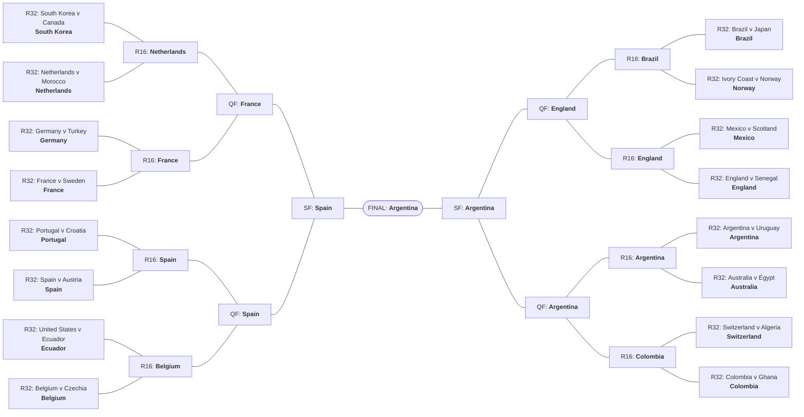

# 🏆 World Cup 2026 — Live Re-Simulation

Updated reach-probabilities from a re-run of the Monte Carlo with all
**finished group matches seeded** and Elo re-scraped — only the unplayed
remainder of the tournament is simulated. The pre-tournament forecast lives
in `showcase.md`. _Snapshot: 2026-06-18 — after Round 1 (Matchday 1)._

## Updated title odds

Model champion: **Argentina** (19.7%). Top 12 by title probability (probability of reaching at least each stage, %).

| team | champion | final | sf | qf | r16 | r32 |
| --- | --- | --- | --- | --- | --- | --- |
| Argentina | 19.7 | 32 | 46.3 | 66.3 | 76.4 | 100 |
| France | 16.4 | 29.5 | 47.6 | 63.6 | 84.8 | 99.9 |
| Spain | 14.1 | 24.8 | 39.7 | 50.1 | 69.5 | 96.4 |
| Portugal | 9.6 | 16.5 | 27.6 | 43.5 | 67.2 | 90 |
| England | 7.7 | 16.8 | 38.1 | 60 | 79.7 | 99.9 |
| Colombia | 7.2 | 14.4 | 25.9 | 49.4 | 74.8 | 99.1 |
| Brazil | 6.5 | 12.1 | 23.6 | 41.7 | 60.2 | 94.6 |
| Netherlands | 3.6 | 8.1 | 17.3 | 36.1 | 50.8 | 92.1 |
| Germany | 2.7 | 7 | 15.7 | 28 | 68 | 99.8 |
| Uruguay | 2.1 | 4.9 | 10.8 | 19.3 | 33.8 | 79.9 |
| Morocco | 1.8 | 4.3 | 10.3 | 24.6 | 43.8 | 88.2 |
| Belgium | 1.7 | 4.7 | 11.9 | 32.2 | 62.2 | 92 |

## 1 · Projected group standings

Per-team group-stage marginals from the re-sim, reflecting the seeded
Round-1 results: `p1`/`p2` are the chances of finishing 1st/2nd; `p3_qualify`/`p3_out` split third place into advancing as a best-third
team vs being eliminated; `exp_points` is expected group points; and
`qualify_prob` is the overall chance of reaching the Round of 32.

**Group A**

| team | p1 | p2 | p3_qualify | p3_out | p4 | exp_points | qualify_prob |
| --- | --- | --- | --- | --- | --- | --- | --- |
| Mexico | 0.6697 | 0.2328 | 0.0843 | 0.0083 | 0.0049 | 2.567 | 0.9868 |
| South Korea | 0.2831 | 0.5232 | 0.1377 | 0.0268 | 0.0293 | 2.06 | 0.944 |
| Czechia | 0.0425 | 0.1714 | 0.3574 | 0.1747 | 0.254 | 1.002 | 0.5713 |
| South Africa | 0.0048 | 0.0727 | 0.1162 | 0.0946 | 0.7118 | 0.3706 | 0.1937 |

**Group B**

| team | p1 | p2 | p3_qualify | p3_out | p4 | exp_points | qualify_prob |
| --- | --- | --- | --- | --- | --- | --- | --- |
| Switzerland | 0.451 | 0.2842 | 0.1157 | 0.0818 | 0.0674 | 2.119 | 0.8509 |
| Canada | 0.3936 | 0.3447 | 0.1282 | 0.0574 | 0.0761 | 2.056 | 0.8665 |
| Bosnia and Herzegovina | 0.1093 | 0.2258 | 0.2397 | 0.1112 | 0.3139 | 1.13 | 0.5748 |
| Qatar | 0.0461 | 0.1453 | 0.1755 | 0.0905 | 0.5426 | 0.6949 | 0.3669 |

**Group C**

| team | p1 | p2 | p3_qualify | p3_out | p4 | exp_points | qualify_prob |
| --- | --- | --- | --- | --- | --- | --- | --- |
| Brazil | 0.5207 | 0.2983 | 0.1268 | 0.0222 | 0.0321 | 2.308 | 0.9458 |
| Morocco | 0.2612 | 0.4088 | 0.2119 | 0.0524 | 0.0656 | 1.865 | 0.8819 |
| Scotland | 0.2119 | 0.2752 | 0.3695 | 0.1151 | 0.0283 | 1.671 | 0.8566 |
| Haiti | 0.0061 | 0.0177 | 0.0667 | 0.0354 | 0.874 | 0.1558 | 0.0905 |

**Group D**

| team | p1 | p2 | p3_qualify | p3_out | p4 | exp_points | qualify_prob |
| --- | --- | --- | --- | --- | --- | --- | --- |
| United States | 0.5637 | 0.2909 | 0.1278 | 0.007 | 0.0107 | 2.408 | 0.9824 |
| Australia | 0.3723 | 0.4246 | 0.1619 | 0.0201 | 0.0211 | 2.148 | 0.9588 |
| Turkey | 0.0379 | 0.1561 | 0.2599 | 0.1291 | 0.4169 | 0.8149 | 0.4539 |
| Paraguay | 0.0261 | 0.1284 | 0.204 | 0.0902 | 0.5513 | 0.6293 | 0.3585 |

**Group E**

| team | p1 | p2 | p3_qualify | p3_out | p4 | exp_points | qualify_prob |
| --- | --- | --- | --- | --- | --- | --- | --- |
| Germany | 0.7077 | 0.1985 | 0.0919 | 0.0011 | 0.0008 | 2.613 | 0.9981 |
| Ivory Coast | 0.2672 | 0.5581 | 0.1464 | 0.0242 | 0.0041 | 2.088 | 0.9717 |
| Ecuador | 0.0246 | 0.2298 | 0.5274 | 0.1459 | 0.0723 | 1.207 | 0.7818 |
| Curaçao | 0.0006 | 0.0136 | 0.0238 | 0.0393 | 0.9228 | 0.0921 | 0.038 |

**Group F**

| team | p1 | p2 | p3_qualify | p3_out | p4 | exp_points | qualify_prob |
| --- | --- | --- | --- | --- | --- | --- | --- |
| Netherlands | 0.4499 | 0.3351 | 0.1364 | 0.033 | 0.0456 | 2.189 | 0.9214 |
| Sweden | 0.2867 | 0.2705 | 0.395 | 0.0244 | 0.0234 | 1.821 | 0.9522 |
| Japan | 0.2521 | 0.3703 | 0.2125 | 0.0619 | 0.1033 | 1.771 | 0.8349 |
| Tunisia | 0.0113 | 0.0241 | 0.0766 | 0.0602 | 0.8277 | 0.2189 | 0.112 |

**Group G**

| team | p1 | p2 | p3_qualify | p3_out | p4 | exp_points | qualify_prob |
| --- | --- | --- | --- | --- | --- | --- | --- |
| Belgium | 0.5649 | 0.2554 | 0.0998 | 0.0295 | 0.0504 | 2.335 | 0.9201 |
| Iran | 0.2314 | 0.2705 | 0.1443 | 0.1779 | 0.1759 | 1.557 | 0.6462 |
| Egypt | 0.1584 | 0.3422 | 0.1869 | 0.0826 | 0.2299 | 1.429 | 0.6875 |
| New Zealand | 0.0454 | 0.1319 | 0.1333 | 0.1457 | 0.5438 | 0.679 | 0.3106 |

**Group H**

| team | p1 | p2 | p3_qualify | p3_out | p4 | exp_points | qualify_prob |
| --- | --- | --- | --- | --- | --- | --- | --- |
| Spain | 0.6772 | 0.229 | 0.0575 | 0.0184 | 0.0179 | 2.566 | 0.9637 |
| Uruguay | 0.2521 | 0.4178 | 0.1296 | 0.1125 | 0.0881 | 1.834 | 0.7995 |
| Cape Verde | 0.0406 | 0.2266 | 0.2343 | 0.1192 | 0.3793 | 0.9285 | 0.5015 |
| Saudi Arabia | 0.0301 | 0.1266 | 0.2005 | 0.1281 | 0.5147 | 0.6721 | 0.3572 |

**Group I**

| team | p1 | p2 | p3_qualify | p3_out | p4 | exp_points | qualify_prob |
| --- | --- | --- | --- | --- | --- | --- | --- |
| France | 0.9323 | 0.0605 | 0.0065 | 0.0004 | 0.0003 | 2.925 | 0.9993 |
| Norway | 0.0609 | 0.5099 | 0.2935 | 0.122 | 0.0137 | 1.618 | 0.8643 |
| Senegal | 0.0065 | 0.418 | 0.2642 | 0.2021 | 0.1093 | 1.322 | 0.6887 |
| Iraq | 0.0004 | 0.0117 | 0.0443 | 0.067 | 0.8767 | 0.1359 | 0.0564 |

**Group J**

| team | p1 | p2 | p3_qualify | p3_out | p4 | exp_points | qualify_prob |
| --- | --- | --- | --- | --- | --- | --- | --- |
| Argentina | 0.9032 | 0.0927 | 0.0037 | 0.0001 | 0.0002 | 2.899 | 0.9996 |
| Austria | 0.0937 | 0.6376 | 0.198 | 0.0663 | 0.0044 | 1.821 | 0.9293 |
| Algeria | 0.0027 | 0.2606 | 0.2787 | 0.2523 | 0.2058 | 1.06 | 0.542 |
| Jordan | 0.0005 | 0.0091 | 0.066 | 0.1349 | 0.7896 | 0.2206 | 0.0756 |

**Group K**

| team | p1 | p2 | p3_qualify | p3_out | p4 | exp_points | qualify_prob |
| --- | --- | --- | --- | --- | --- | --- | --- |
| Colombia | 0.6149 | 0.3177 | 0.0588 | 0.0039 | 0.0046 | 2.543 | 0.9914 |
| Portugal | 0.3526 | 0.4628 | 0.0847 | 0.0597 | 0.0402 | 2.128 | 0.9001 |
| DR Congo | 0.0241 | 0.1291 | 0.235 | 0.2088 | 0.403 | 0.7743 | 0.3882 |
| Uzbekistan | 0.0083 | 0.0904 | 0.1837 | 0.1654 | 0.5522 | 0.5548 | 0.2824 |

**Group L**

| team | p1 | p2 | p3_qualify | p3_out | p4 | exp_points | qualify_prob |
| --- | --- | --- | --- | --- | --- | --- | --- |
| England | 0.9292 | 0.0599 | 0.0098 | 0.0003 | 0.0008 | 2.917 | 0.9989 |
| Croatia | 0.036 | 0.6532 | 0.149 | 0.068 | 0.0938 | 1.631 | 0.8382 |
| Ghana | 0.0316 | 0.2396 | 0.371 | 0.2762 | 0.0816 | 1.221 | 0.6422 |
| Panama | 0.0032 | 0.0474 | 0.0738 | 0.0518 | 0.8238 | 0.23 | 0.1244 |

## 2 · Projected bracket

Modal occupants chained forward — each tie re-simulated 100,000× with the match engine, modal winner advancing. A single
self-consistent **chalk** projection conditioned on the seeded results.

**Projected champion: Argentina**

Full projected bracket table

| match_number | round | team_a | team_b | projected_winner | p_winner |
| --- | --- | --- | --- | --- | --- |
| 73 | R32 | South Korea | Canada | South Korea | 0.5016 |
| 74 | R32 | Germany | Turkey | Germany | 0.7078 |
| 75 | R32 | Netherlands | Morocco | Netherlands | 0.6115 |
| 76 | R32 | Brazil | Japan | Brazil | 0.6452 |
| 77 | R32 | France | Sweden | France | 0.8903 |
| 78 | R32 | Ivory Coast | Norway | Norway | 0.6349 |
| 79 | R32 | Mexico | Scotland | Mexico | 0.6822 |
| 80 | R32 | England | Senegal | England | 0.7254 |
| 81 | R32 | United States | Ecuador | Ecuador | 0.5086 |
| 82 | R32 | Belgium | Czechia | Belgium | 0.7146 |
| 83 | R32 | Portugal | Croatia | Portugal | 0.6866 |
| 84 | R32 | Spain | Austria | Spain | 0.8371 |
| 85 | R32 | Switzerland | Algeria | Switzerland | 0.5543 |
| 86 | R32 | Argentina | Uruguay | Argentina | 0.7538 |
| 87 | R32 | Colombia | Ghana | Colombia | 0.9086 |
| 88 | R32 | Australia | Egypt | Australia | 0.6362 |
| 89 | R16 | South Korea | Netherlands | Netherlands | 0.7511 |
| 90 | R16 | Germany | France | France | 0.6979 |
| 91 | R16 | Brazil | Norway | Brazil | 0.7997 |
| 92 | R16 | Mexico | England | England | 0.7897 |
| 93 | R16 | Portugal | Spain | Spain | 0.5756 |
| 94 | R16 | Ecuador | Belgium | Belgium | 0.5967 |
| 95 | R16 | Argentina | Australia | Argentina | 0.8901 |
| 96 | R16 | Switzerland | Colombia | Colombia | 0.699 |
| 97 | QF | Netherlands | France | France | 0.667 |
| 98 | QF | Spain | Belgium | Spain | 0.7873 |
| 99 | QF | Brazil | England | England | 0.5236 |
| 100 | QF | Argentina | Colombia | Argentina | 0.6442 |
| 101 | SF | France | Spain | Spain | 0.5222 |
| 102 | SF | England | Argentina | Argentina | 0.664 |
| 104 | FINAL | Spain | Argentina | Argentina | 0.5317 |

## 3 · Most common knockout matchups

The ten most likely knockout ties across the whole bracket: `p_meet` is the
probability the pair meets somewhere in the knockouts; `modal_stage` is where
they most often do.

| team_a | team_b | p_meet | modal_stage |
| --- | --- | --- | --- |
| Austria | Spain | 0.4652 | R32 |
| France | Germany | 0.4243 | R16 |
| Argentina | Uruguay | 0.4158 | R32 |
| France | Sweden | 0.3677 | R32 |
| Croatia | Portugal | 0.36 | R32 |
| Argentina | Spain | 0.3465 | R32 |
| England | Mexico | 0.3352 | R16 |
| Brazil | Netherlands | 0.3272 | R32 |
| Colombia | Ghana | 0.3092 | R32 |
| Colombia | Croatia | 0.3072 | R32 |

## 4 · Path difficulty — hardest route

For the top contenders: expected aggregate opponent strength on the knockout
route (`path_strength_sum`) and the per-match average (`avg_opp_strength`,
isolating draw luck from run depth).

| team | exp_ko_matches | path_strength_sum | avg_opp_strength | hardest_stage | champion |
| --- | --- | --- | --- | --- | --- |
| Uruguay | 1.488 | 1.123 | 0.7545 | R32 | 0.0208 |
| Spain | 2.805 | 1.825 | 0.6503 | R32 | 0.1412 |
| Netherlands | 2.044 | 1.199 | 0.5864 | R32 | 0.0358 |
| Brazil | 2.321 | 1.354 | 0.5834 | R32 | 0.0652 |
| Argentina | 3.209 | 1.778 | 0.5539 | R32 | 0.1968 |
| Morocco | 1.712 | 0.9357 | 0.5465 | R32 | 0.018 |
| Germany | 2.185 | 1.193 | 0.5457 | R16 | 0.0273 |
| France | 3.253 | 1.7 | 0.5224 | SF | 0.1641 |
| Portugal | 2.449 | 1.242 | 0.5073 | R16 | 0.0963 |
| Colombia | 2.636 | 1.098 | 0.4164 | QF | 0.072 |
| England | 2.945 | 1.141 | 0.3873 | SF | 0.0769 |
| Belgium | 2.03 | 0.7307 | 0.3599 | QF | 0.017 |

## 5 · Biggest title-odds risers vs the pre-tournament forecast

The 16 teams whose champion probability rose the most since the locked
pre-tournament forecast (`tournament_probs_initial.csv`) — the seeded
Round-1 results' biggest beneficiaries.

| team | champion_initial | champion_updated | delta |
| --- | --- | --- | --- |
| Argentina | 0.1633 | 0.1968 | 0.0335 |
| France | 0.1425 | 0.1641 | 0.0216 |
| England | 0.0584 | 0.0769 | 0.0186 |
| Colombia | 0.0618 | 0.072 | 0.0103 |
| United States | 0.0025 | 0.0046 | 0.0021 |
| Australia | 0.001 | 0.0025 | 0.0014 |
| Ivory Coast | 0.0031 | 0.0042 | 0.0011 |
| Austria | 0.0044 | 0.0054 | 0.001 |
| South Korea | 0.001 | 0.0016 | 0.0006 |
| Sweden | 0.0007 | 0.001 | 0.0003 |
| Scotland | 0.0014 | 0.0016 | 0.0002 |
| Cape Verde | 0 | 0 | 0 |
| Norway | 0.0002 | 0.0002 | 0 |
| Egypt | 0.0006 | 0.0006 | 0 |
| DR Congo | 0 | 0.0001 | 0 |
| Ghana | 0 | 0 | 0 |

---
_Generated by `src/showcase.py::build_live_showcase` from the re-sim artifacts in `data/result/live/`. Re-run `uv run python -m src.cli resim` to refresh after each matchday._

