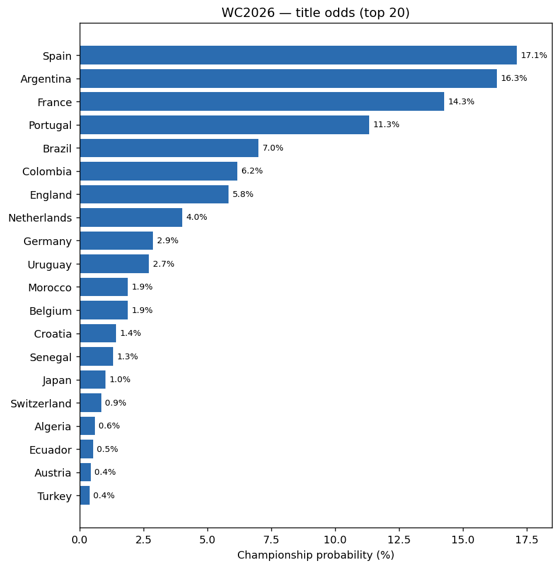
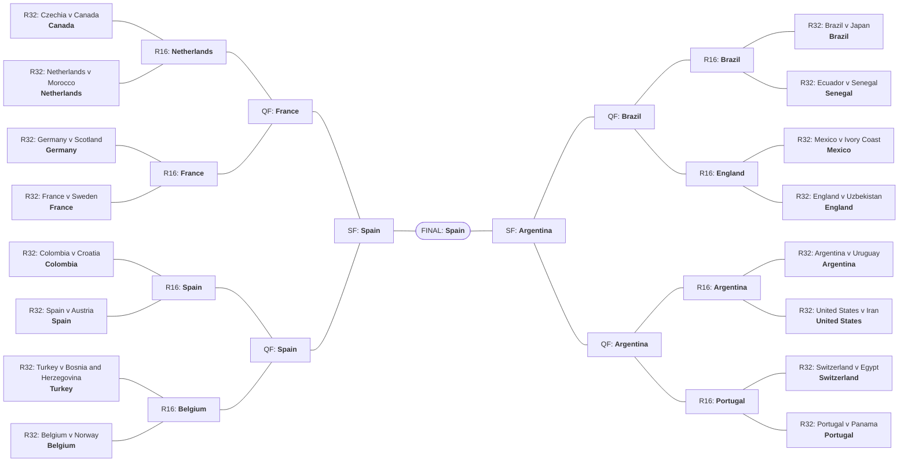
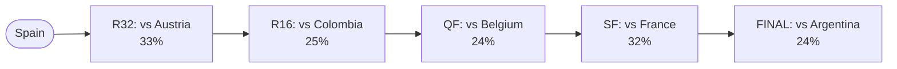
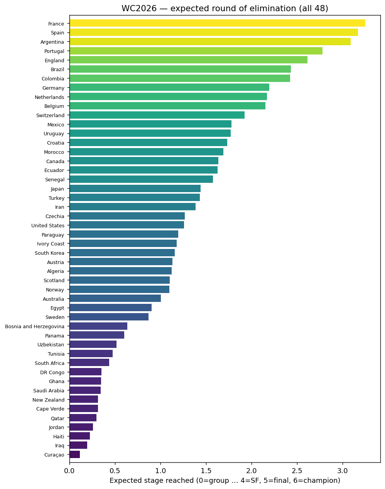
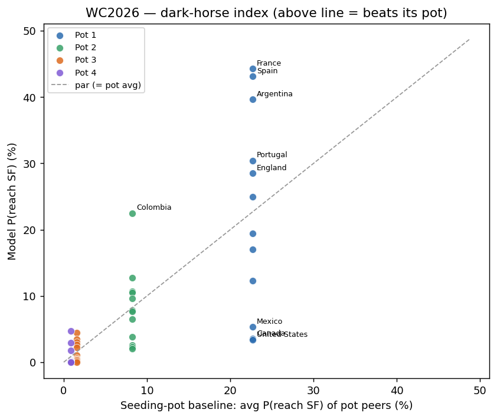

# 🏆 World Cup 2026 — Model Projections

Derived forecasts read straight off a 100k-simulation Monte Carlo of the
tournament (weighted-Poisson goal model on Elo covariates). All figures are
**marginals**, not a single most-likely bracket. _Snapshot: 2026-06-11._

## Title odds

## 1 · Group standings & the group of death

`death_index` = expected strength (model net-xG, rebased so the weakest team
is 0) of the teams a group is likely to **eliminate** — a high value is a
genuine group of death.

| rank | group | death_index | top seed | median xPts |
| --- | --- | --- | --- | --- |
| 1 | F | 1.774 | Netherlands | 1.487 |
| 2 | D | 1.707 | Turkey | 1.504 |
| 3 | A | 1.597 | Mexico | 1.521 |
| 4 | J | 1.4 | Argentina | 1.415 |
| 5 | I | 1.343 | France | 1.486 |
| 6 | K | 1.187 | Portugal | 1.514 |
| 7 | G | 1.079 | Belgium | 1.524 |
| 8 | H | 0.9791 | Spain | 1.316 |
| 9 | L | 0.9547 | England | 1.459 |
| 10 | C | 0.7717 | Brazil | 1.627 |
| 11 | B | 0.7217 | Switzerland | 1.567 |
| 12 | E | 0.5921 | Germany | 1.685 |

Full per-group standings (P1/P2/P3-qualify/out, xPts)

**Group A**

| team | p1 | p2 | p3_qualify | p3_out | p4 | exp_points | qualify_prob |
| --- | --- | --- | --- | --- | --- | --- | --- |
| Mexico | 0.5569 | 0.2657 | 0.1063 | 0.0237 | 0.0474 | 2.332 | 0.9289 |
| Czechia | 0.2169 | 0.3181 | 0.2191 | 0.0746 | 0.1713 | 1.581 | 0.7541 |
| South Korea | 0.1868 | 0.2935 | 0.2249 | 0.0892 | 0.2056 | 1.462 | 0.7052 |
| South Africa | 0.0394 | 0.1226 | 0.1623 | 0.0999 | 0.5758 | 0.6256 | 0.3243 |

**Group B**

| team | p1 | p2 | p3_qualify | p3_out | p4 | exp_points | qualify_prob |
| --- | --- | --- | --- | --- | --- | --- | --- |
| Switzerland | 0.5205 | 0.3475 | 0.0897 | 0.0162 | 0.0261 | 2.362 | 0.9577 |
| Canada | 0.4061 | 0.4178 | 0.1114 | 0.0262 | 0.0385 | 2.192 | 0.9353 |
| Bosnia and Herzegovina | 0.0545 | 0.16 | 0.2788 | 0.1795 | 0.3271 | 0.9418 | 0.4933 |
| Qatar | 0.0188 | 0.0747 | 0.1594 | 0.1389 | 0.6082 | 0.5041 | 0.2529 |

**Group C**

| team | p1 | p2 | p3_qualify | p3_out | p4 | exp_points | qualify_prob |
| --- | --- | --- | --- | --- | --- | --- | --- |
| Brazil | 0.5631 | 0.2745 | 0.112 | 0.0182 | 0.0323 | 2.369 | 0.9496 |
| Morocco | 0.2839 | 0.3787 | 0.1986 | 0.0568 | 0.082 | 1.865 | 0.8612 |
| Scotland | 0.1356 | 0.2825 | 0.306 | 0.1107 | 0.1652 | 1.389 | 0.7241 |
| Haiti | 0.0175 | 0.0643 | 0.1123 | 0.0854 | 0.7206 | 0.3788 | 0.1941 |

**Group D**

| team | p1 | p2 | p3_qualify | p3_out | p4 | exp_points | qualify_prob |
| --- | --- | --- | --- | --- | --- | --- | --- |
| Turkey | 0.3257 | 0.2602 | 0.1738 | 0.0492 | 0.1911 | 1.72 | 0.7597 |
| United States | 0.2501 | 0.2605 | 0.195 | 0.0598 | 0.2345 | 1.526 | 0.7056 |
| Paraguay | 0.2407 | 0.2529 | 0.19 | 0.0634 | 0.253 | 1.481 | 0.6836 |
| Australia | 0.1835 | 0.2264 | 0.1981 | 0.0707 | 0.3213 | 1.272 | 0.608 |

**Group E**

| team | p1 | p2 | p3_qualify | p3_out | p4 | exp_points | qualify_prob |
| --- | --- | --- | --- | --- | --- | --- | --- |
| Germany | 0.567 | 0.2892 | 0.1156 | 0.0132 | 0.0149 | 2.408 | 0.9718 |
| Ecuador | 0.2933 | 0.3989 | 0.2183 | 0.0469 | 0.0427 | 1.943 | 0.9105 |
| Ivory Coast | 0.1349 | 0.2821 | 0.3319 | 0.1267 | 0.1244 | 1.427 | 0.7489 |
| Curaçao | 0.0048 | 0.0298 | 0.0723 | 0.0751 | 0.818 | 0.2214 | 0.1069 |

**Group F**

| team | p1 | p2 | p3_qualify | p3_out | p4 | exp_points | qualify_prob |
| --- | --- | --- | --- | --- | --- | --- | --- |
| Netherlands | 0.5501 | 0.2694 | 0.1086 | 0.0214 | 0.0504 | 2.319 | 0.9281 |
| Japan | 0.2737 | 0.345 | 0.1835 | 0.0589 | 0.1389 | 1.754 | 0.8022 |
| Sweden | 0.125 | 0.2482 | 0.2476 | 0.1017 | 0.2775 | 1.221 | 0.6208 |
| Tunisia | 0.0512 | 0.1374 | 0.1769 | 0.1014 | 0.5332 | 0.7067 | 0.3655 |

**Group G**

| team | p1 | p2 | p3_qualify | p3_out | p4 | exp_points | qualify_prob |
| --- | --- | --- | --- | --- | --- | --- | --- |
| Belgium | 0.6036 | 0.2572 | 0.0909 | 0.0181 | 0.0301 | 2.434 | 0.9517 |
| Iran | 0.2585 | 0.3931 | 0.1863 | 0.0616 | 0.1005 | 1.81 | 0.8379 |
| Egypt | 0.1149 | 0.2554 | 0.2529 | 0.1305 | 0.2463 | 1.239 | 0.6232 |
| New Zealand | 0.023 | 0.0942 | 0.1493 | 0.1104 | 0.6231 | 0.5171 | 0.2665 |

**Group H**

| team | p1 | p2 | p3_qualify | p3_out | p4 | exp_points | qualify_prob |
| --- | --- | --- | --- | --- | --- | --- | --- |
| Spain | 0.7826 | 0.1995 | 0.0152 | 0.0012 | 0.0016 | 2.763 | 0.9973 |
| Uruguay | 0.2032 | 0.6289 | 0.0922 | 0.0402 | 0.0354 | 2 | 0.9243 |
| Saudi Arabia | 0.0089 | 0.0894 | 0.1848 | 0.2423 | 0.4746 | 0.6326 | 0.2831 |
| Cape Verde | 0.0053 | 0.0822 | 0.1804 | 0.2437 | 0.4884 | 0.6044 | 0.2679 |

**Group I**

| team | p1 | p2 | p3_qualify | p3_out | p4 | exp_points | qualify_prob |
| --- | --- | --- | --- | --- | --- | --- | --- |
| France | 0.7602 | 0.1807 | 0.0422 | 0.0071 | 0.0097 | 2.691 | 0.9831 |
| Senegal | 0.1637 | 0.4258 | 0.2088 | 0.0961 | 0.1056 | 1.648 | 0.7983 |
| Norway | 0.0695 | 0.337 | 0.2971 | 0.1439 | 0.1525 | 1.323 | 0.7036 |
| Iraq | 0.0066 | 0.0565 | 0.0951 | 0.1096 | 0.7322 | 0.3375 | 0.1582 |

**Group J**

| team | p1 | p2 | p3_qualify | p3_out | p4 | exp_points | qualify_prob |
| --- | --- | --- | --- | --- | --- | --- | --- |
| Argentina | 0.7855 | 0.1598 | 0.043 | 0.0042 | 0.0075 | 2.723 | 0.9883 |
| Austria | 0.1021 | 0.3878 | 0.2482 | 0.109 | 0.153 | 1.439 | 0.7381 |
| Algeria | 0.1025 | 0.3607 | 0.2447 | 0.1173 | 0.1748 | 1.391 | 0.7079 |
| Jordan | 0.01 | 0.0917 | 0.1191 | 0.1145 | 0.6648 | 0.447 | 0.2208 |

**Group K**

| team | p1 | p2 | p3_qualify | p3_out | p4 | exp_points | qualify_prob |
| --- | --- | --- | --- | --- | --- | --- | --- |
| Portugal | 0.5353 | 0.353 | 0.0726 | 0.0163 | 0.0229 | 2.401 | 0.9609 |
| Colombia | 0.4155 | 0.4482 | 0.0866 | 0.0224 | 0.0273 | 2.252 | 0.9503 |
| Uzbekistan | 0.0298 | 0.1161 | 0.2551 | 0.1999 | 0.3991 | 0.7766 | 0.401 |
| DR Congo | 0.0194 | 0.0828 | 0.1788 | 0.1684 | 0.5506 | 0.571 | 0.281 |

**Group L**

| team | p1 | p2 | p3_qualify | p3_out | p4 | exp_points | qualify_prob |
| --- | --- | --- | --- | --- | --- | --- | --- |
| England | 0.6235 | 0.2846 | 0.064 | 0.011 | 0.0169 | 2.515 | 0.9721 |
| Croatia | 0.3088 | 0.4567 | 0.1419 | 0.0365 | 0.0561 | 2.018 | 0.9074 |
| Panama | 0.0461 | 0.1641 | 0.2776 | 0.1553 | 0.3569 | 0.8994 | 0.4878 |
| Ghana | 0.0215 | 0.0945 | 0.1811 | 0.1327 | 0.5701 | 0.5673 | 0.2971 |

## 2 · Projected bracket

Modal R32 occupants chained forward — each tie re-simulated 100,000× with the match engine, modal winner advancing. A single
self-consistent **chalk** projection conditioned on the modal R32; the honest
marginals are in §3 and §6.

**Projected champion: Spain**

Full projected bracket table

| match_number | round | team_a | team_b | projected_winner | p_winner |
| --- | --- | --- | --- | --- | --- |
| 73 | R32 | Czechia | Canada | Canada | 0.5224 |
| 74 | R32 | Germany | Scotland | Germany | 0.742 |
| 75 | R32 | Netherlands | Morocco | Netherlands | 0.6221 |
| 76 | R32 | Brazil | Japan | Brazil | 0.6566 |
| 77 | R32 | France | Sweden | France | 0.8912 |
| 78 | R32 | Ecuador | Senegal | Senegal | 0.5187 |
| 79 | R32 | Mexico | Ivory Coast | Mexico | 0.7039 |
| 80 | R32 | England | Uzbekistan | England | 0.9085 |
| 81 | R32 | Turkey | Bosnia and Herzegovina | Turkey | 0.8132 |
| 82 | R32 | Belgium | Norway | Belgium | 0.6378 |
| 83 | R32 | Colombia | Croatia | Colombia | 0.6419 |
| 84 | R32 | Spain | Austria | Spain | 0.8671 |
| 85 | R32 | Switzerland | Egypt | Switzerland | 0.724 |
| 86 | R32 | Argentina | Uruguay | Argentina | 0.732 |
| 87 | R32 | Portugal | Panama | Portugal | 0.8701 |
| 88 | R32 | United States | Iran | United States | 0.5516 |
| 89 | R16 | Canada | Netherlands | Netherlands | 0.75 |
| 90 | R16 | Germany | France | France | 0.6849 |
| 91 | R16 | Brazil | Senegal | Brazil | 0.6479 |
| 92 | R16 | Mexico | England | England | 0.759 |
| 93 | R16 | Colombia | Spain | Spain | 0.6538 |
| 94 | R16 | Turkey | Belgium | Belgium | 0.6042 |
| 95 | R16 | Argentina | United States | Argentina | 0.8943 |
| 96 | R16 | Switzerland | Portugal | Portugal | 0.7106 |
| 97 | QF | Netherlands | France | France | 0.6493 |
| 98 | QF | Spain | Belgium | Spain | 0.7939 |
| 99 | QF | Brazil | England | Brazil | 0.5051 |
| 100 | QF | Argentina | Portugal | Argentina | 0.5635 |
| 101 | SF | France | Spain | Spain | 0.5695 |
| 102 | SF | Brazil | Argentina | Argentina | 0.614 |
| 104 | FINAL | Spain | Argentina | Spain | 0.5051 |

## 3 · The favorite's most-likely title path — Spain

Per-stage modal opponent (a marginal at each round, *not* a joint claim that
this exact path happens).

## 4 · Expected round of elimination

One number per team — the expected stage reached (0 = group … 6 = champion) —
linearly ranking all 48.

## 5 · Dark-horse / overperformance index

Each team's P(reach semis) vs the average of its **seeding pot**. Positive
`overperformance` = the model is more bullish than the draw implies.

**Biggest overperformers (outside Pot 1)**

| team | pot | champion | deep_run | pot_baseline | overperformance |
| --- | --- | --- | --- | --- | --- |
| Colombia | 2 | 0.0618 | 0.2249 | 0.0823 | 0.1427 |
| Uruguay | 2 | 0.0272 | 0.127 | 0.0823 | 0.0448 |
| Turkey | 4 | 0.0039 | 0.0472 | 0.0086 | 0.0387 |
| Algeria | 3 | 0.006 | 0.0444 | 0.0158 | 0.0286 |
| Morocco | 2 | 0.0189 | 0.1066 | 0.0823 | 0.0243 |
| Croatia | 2 | 0.0143 | 0.1052 | 0.0823 | 0.023 |
| Czechia | 4 | 0.0013 | 0.0289 | 0.0086 | 0.0203 |
| Ivory Coast | 3 | 0.0031 | 0.0342 | 0.0158 | 0.0185 |

## 6 · Per-slot Round-of-32 marginals

The modal occupant (and runners-up) of each R32 slot — honest where no team
owns a slot, especially the third-place-fed `3XXXXX` slots.

| match_number | slot | opponent_slot | modal_team | modal_prob | runners_up |
| --- | --- | --- | --- | --- | --- |
| 73 | 2A | 2B | Czechia | 0.3181 | South Korea (0.29), Mexico (0.27) |
| 73 | 2B | 2A | Canada | 0.4178 | Switzerland (0.35), Bosnia and Herzegovina (0.16) |
| 74 | 1E | 3ABCDF | Germany | 0.567 | Ecuador (0.29), Ivory Coast (0.13) |
| 74 | 3ABCDF | 1E | Scotland | 0.177 | Australia (0.13), United States (0.13) |
| 75 | 1F | 2C | Netherlands | 0.5501 | Japan (0.27), Sweden (0.12) |
| 75 | 2C | 1F | Morocco | 0.3787 | Scotland (0.28), Brazil (0.27) |
| 76 | 1C | 2F | Brazil | 0.5631 | Morocco (0.28), Scotland (0.14) |
| 76 | 2F | 1C | Japan | 0.345 | Netherlands (0.27), Sweden (0.25) |
| 77 | 1I | 3CDFGH | France | 0.7602 | Senegal (0.16), Norway (0.07) |
| 77 | 3CDFGH | 1I | Sweden | 0.2185 | Japan (0.16), Tunisia (0.16) |
| 78 | 2E | 2I | Ecuador | 0.3989 | Germany (0.29), Ivory Coast (0.28) |
| 78 | 2I | 2E | Senegal | 0.4258 | Norway (0.34), France (0.18) |
| 79 | 1A | 3CEFHI | Mexico | 0.5569 | Czechia (0.22), South Korea (0.19) |
| 79 | 3CEFHI | 1A | Ivory Coast | 0.1637 | Scotland (0.13), Saudi Arabia (0.11) |
| 80 | 1L | 3EHIJK | England | 0.6235 | Croatia (0.31), Panama (0.05) |
| 80 | 3EHIJK | 1L | Uzbekistan | 0.2551 | DR Congo (0.18), Norway (0.12) |
| 81 | 1D | 3BEFIJ | Turkey | 0.3257 | United States (0.25), Paraguay (0.24) |
| 81 | 3BEFIJ | 1D | Bosnia and Herzegovina | 0.2786 | Qatar (0.16), Canada (0.11) |
| 82 | 1G | 3AEHIJ | Belgium | 0.6036 | Iran (0.26), Egypt (0.11) |
| 82 | 3AEHIJ | 1G | South Korea | 0.218 | Czechia (0.21), South Africa (0.16) |
| 83 | 2K | 2L | Colombia | 0.4482 | Portugal (0.35), Uzbekistan (0.12) |
| 83 | 2L | 2K | Croatia | 0.4567 | England (0.28), Panama (0.16) |
| 84 | 1H | 2J | Spain | 0.7826 | Uruguay (0.20), Saudi Arabia (0.01) |
| 84 | 2J | 1H | Austria | 0.3878 | Algeria (0.36), Argentina (0.16) |
| 85 | 1B | 3EFGIJ | Switzerland | 0.5205 | Canada (0.41), Bosnia and Herzegovina (0.05) |
| 85 | 3EFGIJ | 1B | Egypt | 0.2148 | Iran (0.16), Austria (0.13) |
| 86 | 1J | 2H | Argentina | 0.7855 | Algeria (0.10), Austria (0.10) |
| 86 | 2H | 1J | Uruguay | 0.6289 | Spain (0.20), Saudi Arabia (0.09) |
| 87 | 1K | 3DEIJL | Portugal | 0.5353 | Colombia (0.42), Uzbekistan (0.03) |
| 87 | 3DEIJL | 1K | Panama | 0.2776 | Ghana (0.18), Croatia (0.14) |
| 88 | 2D | 2G | United States | 0.2605 | Turkey (0.26), Paraguay (0.25) |
| 88 | 2G | 2D | Iran | 0.3931 | Belgium (0.26), Egypt (0.26) |

## 7 · Marquee matchup probabilities

Among the six title favorites: P(they meet) by stage, the chance of a given
final, and who knocks out whom.

| team_a | team_b | p_r32 | p_r16 | p_qf | p_sf | P(final) | P(meet) | P(A out B) | P(B out A) |
| --- | --- | --- | --- | --- | --- | --- | --- | --- | --- |
| Spain | Argentina | 0.2811 | 0 | 0.0063 | 0.0016 | 0.0682 | 0.3572 | 0.1771 | 0.1802 |
| Spain | Colombia | 0 | 0.1829 | 0.0223 | 0.0015 | 0.0218 | 0.2285 | 0.1475 | 0.0809 |
| Spain | Portugal | 0 | 0.1543 | 0.0296 | 0.0021 | 0.0379 | 0.2239 | 0.1203 | 0.1037 |
| Argentina | Portugal | 0.0006 | 0.0267 | 0.1688 | 0.007 | 0.0196 | 0.2227 | 0.1166 | 0.1061 |
| Argentina | Colombia | 0.0004 | 0.0296 | 0.1252 | 0.0056 | 0.0134 | 0.1742 | 0.108 | 0.0661 |
| France | Brazil | 0.0004 | 0.0794 | 0.0639 | 0.0009 | 0.0235 | 0.1681 | 0.0973 | 0.0708 |
| Spain | France | 0.0012 | 0.0002 | 0.0034 | 0.1399 | 0.021 | 0.1656 | 0.0926 | 0.073 |
| Argentina | France | 0 | 0.0002 | 0.0032 | 0.0421 | 0.0539 | 0.0994 | 0.0555 | 0.0439 |
| France | Portugal | 0.0056 | 0.0005 | 0.0036 | 0.0483 | 0.0323 | 0.0903 | 0.0442 | 0.0461 |
| Argentina | Brazil | 0 | 0.0001 | 0.0005 | 0.0655 | 0.0133 | 0.0794 | 0.0442 | 0.0351 |
| France | Colombia | 0.0046 | 0.0005 | 0.0037 | 0.041 | 0.0193 | 0.0691 | 0.0394 | 0.0297 |
| Spain | Brazil | 0 | 0 | 0.0014 | 0.0369 | 0.0249 | 0.0632 | 0.0345 | 0.0286 |
| Portugal | Brazil | 0 | 0.0012 | 0.0078 | 0.0406 | 0.0101 | 0.0597 | 0.032 | 0.0278 |
| Brazil | Colombia | 0 | 0.0011 | 0.0074 | 0.0275 | 0.0073 | 0.0433 | 0.0228 | 0.0205 |
| Portugal | Colombia | 0 | 0 | 0 | 0.0082 | 0.0195 | 0.0277 | 0.0163 | 0.0115 |

## 8 · Path difficulty — hardest route

For the top contenders: expected aggregate opponent strength on the knockout
route (`path_strength_sum`) and the per-match average (`avg_opp_strength`,
isolating draw luck from run depth).

| team | exp_ko_matches | path_strength_sum | avg_opp_strength | hardest_stage | champion |
| --- | --- | --- | --- | --- | --- |
| Uruguay | 1.743 | 1.322 | 0.7583 | R32 | 0.0272 |
| Argentina | 2.925 | 1.878 | 0.6422 | R32 | 0.1633 |
| Spain | 2.999 | 1.863 | 0.6211 | R32 | 0.171 |
| Brazil | 2.362 | 1.312 | 0.5553 | R32 | 0.0699 |
| Morocco | 1.673 | 0.8724 | 0.5214 | R32 | 0.0189 |
| Netherlands | 2.129 | 1.108 | 0.5204 | R32 | 0.0401 |
| Germany | 2.165 | 1.08 | 0.4987 | R16 | 0.0288 |
| France | 3.109 | 1.505 | 0.484 | SF | 0.1425 |
| Colombia | 2.364 | 1.139 | 0.4816 | R16 | 0.0618 |
| England | 2.558 | 1.231 | 0.4812 | SF | 0.0584 |
| Portugal | 2.665 | 1.239 | 0.4648 | R16 | 0.1133 |
| Belgium | 2.133 | 0.7134 | 0.3345 | QF | 0.0188 |

---
_Generated by `src/showcase.py` from the forecast artifacts in `data/result/forecast/`. Re-run the Monte Carlo (main.py Stage 7) to refresh._

