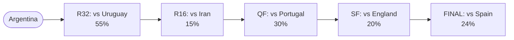
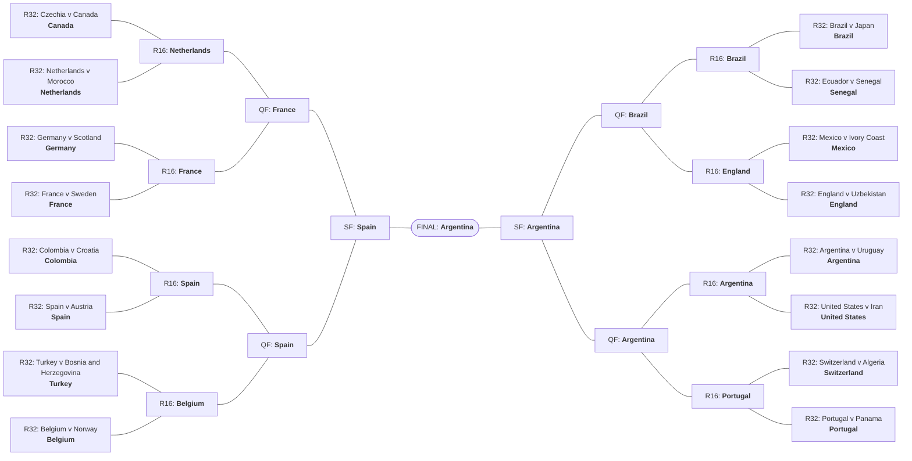

# 🏆 World Cup 2026 — Model Projections

Derived forecasts read straight off a 100k-simulation Monte Carlo of the
tournament (weighted-Poisson goal model on Elo covariates). All figures are
**marginals**, not a single most-likely bracket. _Snapshot: 2026-06-09._

## Title odds

## 1 · Group standings & the group of death

`death_index` = expected strength (model net-xG, rebased so the weakest team
is 0) of the teams a group is likely to **eliminate** — a high value is a
genuine group of death.

| rank | group | death_index | top seed | median xPts |
| --- | --- | --- | --- | --- |
| 1 | F | 1.766 | Netherlands | 1.485 |
| 2 | D | 1.703 | Turkey | 1.511 |
| 3 | A | 1.587 | Mexico | 1.519 |
| 4 | I | 1.378 | France | 1.47 |
| 5 | J | 1.364 | Argentina | 1.431 |
| 6 | K | 1.164 | Portugal | 1.524 |
| 7 | G | 1.097 | Belgium | 1.499 |
| 8 | L | 0.9521 | England | 1.462 |
| 9 | H | 0.9417 | Spain | 1.355 |
| 10 | C | 0.7328 | Brazil | 1.633 |
| 11 | B | 0.7208 | Switzerland | 1.556 |
| 12 | E | 0.594 | Germany | 1.678 |

Full per-group standings (P1/P2/P3-qualify/out, xPts)

**Group A**

| team | p1 | p2 | p3_qualify | p3_out | p4 | exp_points | qualify_prob |
| --- | --- | --- | --- | --- | --- | --- | --- |
| Mexico | 0.554 | 0.2661 | 0.1094 | 0.0232 | 0.0473 | 2.327 | 0.9295 |
| Czechia | 0.2256 | 0.3229 | 0.2154 | 0.0695 | 0.1665 | 1.607 | 0.7639 |
| South Korea | 0.1806 | 0.2869 | 0.2245 | 0.09 | 0.218 | 1.43 | 0.692 |
| South Africa | 0.0398 | 0.124 | 0.1691 | 0.0989 | 0.5682 | 0.6354 | 0.3329 |

**Group B**

| team | p1 | p2 | p3_qualify | p3_out | p4 | exp_points | qualify_prob |
| --- | --- | --- | --- | --- | --- | --- | --- |
| Switzerland | 0.5283 | 0.344 | 0.086 | 0.0159 | 0.0258 | 2.375 | 0.9583 |
| Canada | 0.4009 | 0.4209 | 0.1122 | 0.0266 | 0.0394 | 2.183 | 0.934 |
| Bosnia and Herzegovina | 0.0522 | 0.1575 | 0.2807 | 0.1767 | 0.3329 | 0.929 | 0.4904 |
| Qatar | 0.0185 | 0.0776 | 0.1651 | 0.1368 | 0.6019 | 0.5126 | 0.2612 |

**Group C**

| team | p1 | p2 | p3_qualify | p3_out | p4 | exp_points | qualify_prob |
| --- | --- | --- | --- | --- | --- | --- | --- |
| Brazil | 0.5691 | 0.2784 | 0.1084 | 0.017 | 0.0271 | 2.389 | 0.9559 |
| Morocco | 0.2917 | 0.3912 | 0.194 | 0.0535 | 0.0696 | 1.905 | 0.8769 |
| Scotland | 0.126 | 0.2734 | 0.3207 | 0.1159 | 0.1641 | 1.361 | 0.7201 |
| Haiti | 0.0132 | 0.057 | 0.1067 | 0.0838 | 0.7392 | 0.3441 | 0.1769 |

**Group D**

| team | p1 | p2 | p3_qualify | p3_out | p4 | exp_points | qualify_prob |
| --- | --- | --- | --- | --- | --- | --- | --- |
| Turkey | 0.3202 | 0.2631 | 0.1734 | 0.0495 | 0.1938 | 1.71 | 0.7567 |
| United States | 0.2567 | 0.2598 | 0.1914 | 0.0594 | 0.2327 | 1.54 | 0.7079 |
| Paraguay | 0.2413 | 0.2516 | 0.1923 | 0.0622 | 0.2526 | 1.482 | 0.6852 |
| Australia | 0.1818 | 0.2255 | 0.2029 | 0.0689 | 0.321 | 1.268 | 0.6102 |

**Group E**

| team | p1 | p2 | p3_qualify | p3_out | p4 | exp_points | qualify_prob |
| --- | --- | --- | --- | --- | --- | --- | --- |
| Germany | 0.5739 | 0.2833 | 0.1142 | 0.0125 | 0.0162 | 2.415 | 0.9714 |
| Ecuador | 0.2797 | 0.3974 | 0.2248 | 0.0505 | 0.0475 | 1.909 | 0.9019 |
| Ivory Coast | 0.141 | 0.2885 | 0.3266 | 0.1201 | 0.1238 | 1.447 | 0.7561 |
| Curaçao | 0.0054 | 0.0308 | 0.0781 | 0.0732 | 0.8125 | 0.2291 | 0.1143 |

**Group F**

| team | p1 | p2 | p3_qualify | p3_out | p4 | exp_points | qualify_prob |
| --- | --- | --- | --- | --- | --- | --- | --- |
| Netherlands | 0.5566 | 0.265 | 0.1081 | 0.0206 | 0.0498 | 2.329 | 0.9297 |
| Japan | 0.2684 | 0.3495 | 0.1852 | 0.0583 | 0.1385 | 1.748 | 0.8031 |
| Sweden | 0.1245 | 0.2488 | 0.2495 | 0.1013 | 0.2759 | 1.222 | 0.6228 |
| Tunisia | 0.0505 | 0.1367 | 0.1785 | 0.0985 | 0.5358 | 0.7019 | 0.3657 |

**Group G**

| team | p1 | p2 | p3_qualify | p3_out | p4 | exp_points | qualify_prob |
| --- | --- | --- | --- | --- | --- | --- | --- |
| Belgium | 0.6095 | 0.252 | 0.0896 | 0.0174 | 0.0316 | 2.439 | 0.9511 |
| Iran | 0.2525 | 0.3922 | 0.1863 | 0.0612 | 0.1078 | 1.789 | 0.831 |
| Egypt | 0.1111 | 0.251 | 0.2445 | 0.1295 | 0.2639 | 1.209 | 0.6066 |
| New Zealand | 0.0268 | 0.1049 | 0.1602 | 0.1113 | 0.5967 | 0.5617 | 0.2919 |

**Group H**

| team | p1 | p2 | p3_qualify | p3_out | p4 | exp_points | qualify_prob |
| --- | --- | --- | --- | --- | --- | --- | --- |
| Spain | 0.7869 | 0.2002 | 0.0114 | 0.0007 | 0.0008 | 2.773 | 0.9985 |
| Uruguay | 0.2027 | 0.6538 | 0.0833 | 0.0337 | 0.0266 | 2.033 | 0.9398 |
| Saudi Arabia | 0.0078 | 0.0888 | 0.2049 | 0.2711 | 0.4274 | 0.677 | 0.3015 |
| Cape Verde | 0.0026 | 0.0572 | 0.1542 | 0.2408 | 0.5453 | 0.5172 | 0.214 |

**Group I**

| team | p1 | p2 | p3_qualify | p3_out | p4 | exp_points | qualify_prob |
| --- | --- | --- | --- | --- | --- | --- | --- |
| France | 0.7578 | 0.1824 | 0.0424 | 0.0072 | 0.0103 | 2.688 | 0.9826 |
| Senegal | 0.1726 | 0.4351 | 0.1948 | 0.0896 | 0.1078 | 1.672 | 0.8025 |
| Norway | 0.0623 | 0.3164 | 0.2939 | 0.1537 | 0.1737 | 1.267 | 0.6726 |
| Iraq | 0.0073 | 0.0661 | 0.103 | 0.1154 | 0.7082 | 0.3725 | 0.1764 |

**Group J**

| team | p1 | p2 | p3_qualify | p3_out | p4 | exp_points | qualify_prob |
| --- | --- | --- | --- | --- | --- | --- | --- |
| Argentina | 0.7922 | 0.1572 | 0.0416 | 0.003 | 0.006 | 2.736 | 0.991 |
| Austria | 0.1032 | 0.4037 | 0.2531 | 0.1054 | 0.1346 | 1.476 | 0.76 |
| Algeria | 0.0976 | 0.3594 | 0.2508 | 0.1241 | 0.1681 | 1.387 | 0.7078 |
| Jordan | 0.007 | 0.0798 | 0.1081 | 0.1139 | 0.6913 | 0.4026 | 0.1949 |

**Group K**

| team | p1 | p2 | p3_qualify | p3_out | p4 | exp_points | qualify_prob |
| --- | --- | --- | --- | --- | --- | --- | --- |
| Portugal | 0.5415 | 0.3589 | 0.068 | 0.013 | 0.0186 | 2.423 | 0.9684 |
| Colombia | 0.4167 | 0.4588 | 0.0809 | 0.0199 | 0.0236 | 2.268 | 0.9564 |
| Uzbekistan | 0.0269 | 0.1119 | 0.2642 | 0.2105 | 0.3865 | 0.7792 | 0.403 |
| DR Congo | 0.0149 | 0.0704 | 0.1738 | 0.1696 | 0.5713 | 0.5289 | 0.2591 |

**Group L**

| team | p1 | p2 | p3_qualify | p3_out | p4 | exp_points | qualify_prob |
| --- | --- | --- | --- | --- | --- | --- | --- |
| England | 0.6161 | 0.2868 | 0.0672 | 0.0112 | 0.0187 | 2.5 | 0.9701 |
| Croatia | 0.3132 | 0.4556 | 0.1389 | 0.0348 | 0.0575 | 2.025 | 0.9077 |
| Panama | 0.0485 | 0.1614 | 0.2806 | 0.1514 | 0.3581 | 0.9003 | 0.4905 |
| Ghana | 0.0221 | 0.0962 | 0.1872 | 0.1288 | 0.5657 | 0.5747 | 0.3055 |

## 2 · Expected round of elimination

One number per team — the expected stage reached (0 = group … 6 = champion) —
linearly ranking all 48.

## 3 · Dark-horse / overperformance index

Each team's P(reach semis) vs the average of its **seeding pot**. Positive
`overperformance` = the model is more bullish than the draw implies.

**Biggest overperformers (outside Pot 1)**

| team | pot | champion | deep_run | pot_baseline | overperformance |
| --- | --- | --- | --- | --- | --- |
| Colombia | 2 | 0.063 | 0.2271 | 0.0835 | 0.1436 |
| Uruguay | 2 | 0.0274 | 0.1286 | 0.0835 | 0.0451 |
| Turkey | 4 | 0.0029 | 0.0404 | 0.0079 | 0.0325 |
| Morocco | 2 | 0.0193 | 0.1131 | 0.0835 | 0.0296 |
| Algeria | 3 | 0.0056 | 0.0412 | 0.0152 | 0.026 |
| Czechia | 4 | 0.0016 | 0.0298 | 0.0079 | 0.0219 |
| Senegal | 2 | 0.0139 | 0.1037 | 0.0835 | 0.0202 |
| Croatia | 2 | 0.0137 | 0.1029 | 0.0835 | 0.0194 |

## 4 · Per-slot Round-of-32 marginals

The modal occupant (and runners-up) of each R32 slot — honest where no team
owns a slot, especially the third-place-fed `3XXXXX` slots.

| match_number | slot | opponent_slot | modal_team | modal_prob | runners_up |
| --- | --- | --- | --- | --- | --- |
| 73 | 2A | 2B | Czechia | 0.3229 | South Korea (0.29), Mexico (0.27) |
| 73 | 2B | 2A | Canada | 0.4209 | Switzerland (0.34), Bosnia and Herzegovina (0.16) |
| 74 | 1E | 3ABCDF | Germany | 0.5739 | Ecuador (0.28), Ivory Coast (0.14) |
| 74 | 3ABCDF | 1E | Scotland | 0.1827 | Australia (0.14), United States (0.13) |
| 75 | 1F | 2C | Netherlands | 0.5566 | Japan (0.27), Sweden (0.12) |
| 75 | 2C | 1F | Morocco | 0.3912 | Brazil (0.28), Scotland (0.27) |
| 76 | 1C | 2F | Brazil | 0.5691 | Morocco (0.29), Scotland (0.13) |
| 76 | 2F | 1C | Japan | 0.3495 | Netherlands (0.26), Sweden (0.25) |
| 77 | 1I | 3CDFGH | France | 0.7578 | Senegal (0.17), Norway (0.06) |
| 77 | 3CDFGH | 1I | Sweden | 0.2207 | Japan (0.16), Tunisia (0.16) |
| 78 | 2E | 2I | Ecuador | 0.3974 | Ivory Coast (0.29), Germany (0.28) |
| 78 | 2I | 2E | Senegal | 0.4351 | Norway (0.32), France (0.18) |
| 79 | 1A | 3CEFHI | Mexico | 0.554 | Czechia (0.23), South Korea (0.18) |
| 79 | 3CEFHI | 1A | Ivory Coast | 0.1602 | Scotland (0.14), Saudi Arabia (0.13) |
| 80 | 1L | 3EHIJK | England | 0.6161 | Croatia (0.31), Panama (0.05) |
| 80 | 3EHIJK | 1L | Uzbekistan | 0.2642 | DR Congo (0.17), Norway (0.12) |
| 81 | 1D | 3BEFIJ | Turkey | 0.3202 | United States (0.26), Paraguay (0.24) |
| 81 | 3BEFIJ | 1D | Bosnia and Herzegovina | 0.2804 | Qatar (0.16), Canada (0.11) |
| 82 | 1G | 3AEHIJ | Belgium | 0.6095 | Iran (0.25), Egypt (0.11) |
| 82 | 3AEHIJ | 1G | South Korea | 0.2174 | Czechia (0.21), South Africa (0.16) |
| 83 | 2K | 2L | Colombia | 0.4588 | Portugal (0.36), Uzbekistan (0.11) |
| 83 | 2L | 2K | Croatia | 0.4556 | England (0.29), Panama (0.16) |
| 84 | 1H | 2J | Spain | 0.7869 | Uruguay (0.20), Saudi Arabia (0.01) |
| 84 | 2J | 1H | Austria | 0.4037 | Algeria (0.36), Argentina (0.16) |
| 85 | 1B | 3EFGIJ | Switzerland | 0.5283 | Canada (0.40), Bosnia and Herzegovina (0.05) |
| 85 | 3EFGIJ | 1B | Egypt | 0.2063 | Iran (0.16), New Zealand (0.14) |
| 86 | 1J | 2H | Argentina | 0.7922 | Austria (0.10), Algeria (0.10) |
| 86 | 2H | 1J | Uruguay | 0.6538 | Spain (0.20), Saudi Arabia (0.09) |
| 87 | 1K | 3DEIJL | Portugal | 0.5415 | Colombia (0.42), Uzbekistan (0.03) |
| 87 | 3DEIJL | 1K | Panama | 0.2806 | Ghana (0.19), Croatia (0.14) |
| 88 | 2D | 2G | Turkey | 0.2631 | United States (0.26), Paraguay (0.25) |
| 88 | 2G | 2D | Iran | 0.3922 | Belgium (0.25), Egypt (0.25) |

## 5 · Marquee matchup probabilities

Among the six title favorites: P(they meet) by stage, the chance of a given
final, and who knocks out whom.

| team_a | team_b | p_r32 | p_r16 | p_qf | p_sf | P(final) | P(meet) | P(A out B) | P(B out A) |
| --- | --- | --- | --- | --- | --- | --- | --- | --- | --- |
| Argentina | Spain | 0.283 | 0 | 0.0061 | 0.0012 | 0.0676 | 0.3579 | 0.194 | 0.164 |
| Spain | Colombia | 0 | 0.1903 | 0.0215 | 0.0015 | 0.0202 | 0.2336 | 0.1493 | 0.0843 |
| Argentina | Portugal | 0.0005 | 0.027 | 0.1754 | 0.0072 | 0.0195 | 0.2297 | 0.1208 | 0.1089 |
| Spain | Portugal | 0 | 0.1583 | 0.0291 | 0.0016 | 0.0363 | 0.2253 | 0.1207 | 0.1046 |
| Argentina | Colombia | 0.0005 | 0.0302 | 0.1253 | 0.0059 | 0.0136 | 0.1755 | 0.1091 | 0.0664 |
| France | Brazil | 0.0005 | 0.0788 | 0.0663 | 0.0008 | 0.0238 | 0.1703 | 0.0968 | 0.0734 |
| Spain | France | 0.0009 | 0.0001 | 0.0036 | 0.1397 | 0.0199 | 0.1642 | 0.0853 | 0.0789 |
| Argentina | France | 0 | 0.0001 | 0.003 | 0.0422 | 0.0575 | 0.1029 | 0.0572 | 0.0458 |
| France | Portugal | 0.0057 | 0.0006 | 0.0034 | 0.0487 | 0.0333 | 0.0917 | 0.0449 | 0.0467 |
| Argentina | Brazil | 0 | 0.0001 | 0.0006 | 0.0663 | 0.0124 | 0.0793 | 0.0456 | 0.0337 |
| France | Colombia | 0.0044 | 0.0004 | 0.0032 | 0.0413 | 0.0196 | 0.0689 | 0.0389 | 0.03 |
| Spain | Brazil | 0 | 0 | 0.0011 | 0.038 | 0.0248 | 0.0639 | 0.0342 | 0.0298 |
| Portugal | Brazil | 0 | 0.0011 | 0.0077 | 0.0414 | 0.0104 | 0.0606 | 0.0336 | 0.0269 |
| Brazil | Colombia | 0 | 0.0011 | 0.0077 | 0.0287 | 0.0071 | 0.0446 | 0.0242 | 0.0203 |
| Portugal | Colombia | 0 | 0 | 0 | 0.0082 | 0.0207 | 0.0289 | 0.0166 | 0.0123 |

## 6 · Path difficulty — hardest route

For the top contenders: expected aggregate opponent strength on the knockout
route (`path_strength_sum`) and the per-match average (`avg_opp_strength`,
isolating draw luck from run depth).

| team | exp_ko_matches | path_strength_sum | avg_opp_strength | hardest_stage | champion |
| --- | --- | --- | --- | --- | --- |
| Uruguay | 1.761 | 1.359 | 0.7713 | R32 | 0.0274 |
| Argentina | 2.951 | 1.94 | 0.6574 | R32 | 0.1729 |
| Spain | 2.995 | 1.889 | 0.6306 | R32 | 0.1563 |
| Brazil | 2.378 | 1.317 | 0.5538 | R32 | 0.0709 |
| Netherlands | 2.133 | 1.128 | 0.5289 | R32 | 0.0414 |
| Morocco | 1.716 | 0.9058 | 0.5278 | R32 | 0.0193 |
| Germany | 2.162 | 1.073 | 0.4964 | R16 | 0.0276 |
| France | 3.111 | 1.517 | 0.4877 | SF | 0.1454 |
| Colombia | 2.382 | 1.153 | 0.484 | R16 | 0.063 |
| England | 2.544 | 1.227 | 0.4823 | SF | 0.0592 |
| Portugal | 2.69 | 1.25 | 0.4646 | R16 | 0.1133 |
| Belgium | 2.138 | 0.7218 | 0.3376 | QF | 0.0187 |

## 7 · The favorite's most-likely title path — Argentina

Per-stage modal opponent (a marginal at each round, *not* a joint claim that
this exact path happens).

## 8 · Projected bracket

Modal R32 occupants chained forward — each tie re-simulated 100,000× with the match engine, modal winner advancing. A single
self-consistent **chalk** projection conditioned on the modal R32; the honest
marginals are in §4 and §7.

**Projected champion: Argentina**

Full projected bracket table

| match_number | round | team_a | team_b | projected_winner | p_winner |
| --- | --- | --- | --- | --- | --- |
| 73 | R32 | Czechia | Canada | Canada | 0.5234 |
| 74 | R32 | Germany | Scotland | Germany | 0.75 |
| 75 | R32 | Netherlands | Morocco | Netherlands | 0.622 |
| 76 | R32 | Brazil | Japan | Brazil | 0.6568 |
| 77 | R32 | France | Sweden | France | 0.8915 |
| 78 | R32 | Ecuador | Senegal | Senegal | 0.5301 |
| 79 | R32 | Mexico | Ivory Coast | Mexico | 0.7014 |
| 80 | R32 | England | Uzbekistan | England | 0.91 |
| 81 | R32 | Turkey | Bosnia and Herzegovina | Turkey | 0.8244 |
| 82 | R32 | Belgium | Norway | Belgium | 0.6473 |
| 83 | R32 | Colombia | Croatia | Colombia | 0.6407 |
| 84 | R32 | Spain | Austria | Spain | 0.8749 |
| 85 | R32 | Switzerland | Algeria | Switzerland | 0.5703 |
| 86 | R32 | Argentina | Uruguay | Argentina | 0.73 |
| 87 | R32 | Portugal | Panama | Portugal | 0.869 |
| 88 | R32 | United States | Iran | United States | 0.5572 |
| 89 | R16 | Canada | Netherlands | Netherlands | 0.7508 |
| 90 | R16 | Germany | France | France | 0.6847 |
| 91 | R16 | Brazil | Senegal | Brazil | 0.64 |
| 92 | R16 | Mexico | England | England | 0.7562 |
| 93 | R16 | Colombia | Spain | Spain | 0.6537 |
| 94 | R16 | Turkey | Belgium | Belgium | 0.6143 |
| 95 | R16 | Argentina | United States | Argentina | 0.8919 |
| 96 | R16 | Switzerland | Portugal | Portugal | 0.7084 |
| 97 | QF | Netherlands | France | France | 0.6493 |
| 98 | QF | Spain | Belgium | Spain | 0.8031 |
| 99 | QF | Brazil | England | Brazil | 0.5076 |
| 100 | QF | Argentina | Portugal | Argentina | 0.5678 |
| 101 | SF | France | Spain | Spain | 0.5588 |
| 102 | SF | Brazil | Argentina | Argentina | 0.6171 |
| 104 | FINAL | Spain | Argentina | Argentina | 0.5262 |

---
_Generated by `src/showcase.py` from the forecast artifacts in `data/result/forecast/`. Re-run the Monte Carlo (main.py Stage 7) to refresh._

